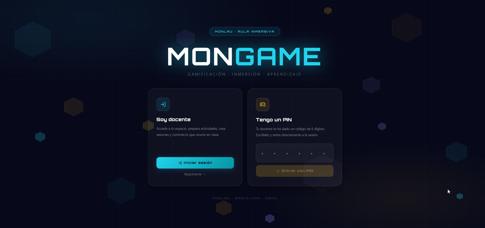
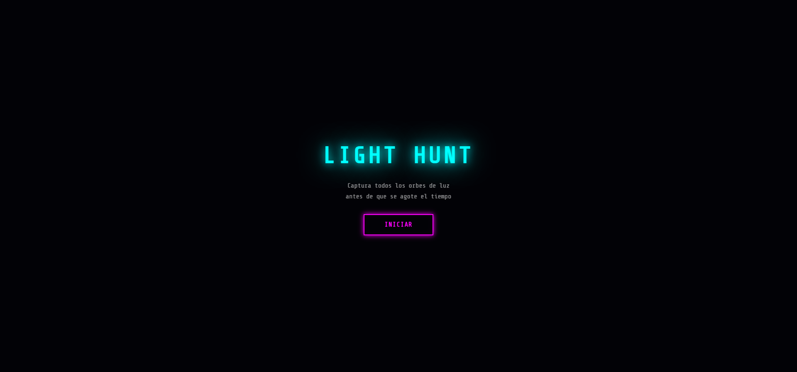
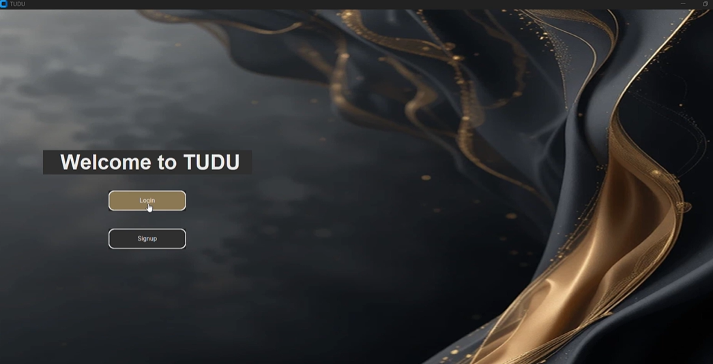
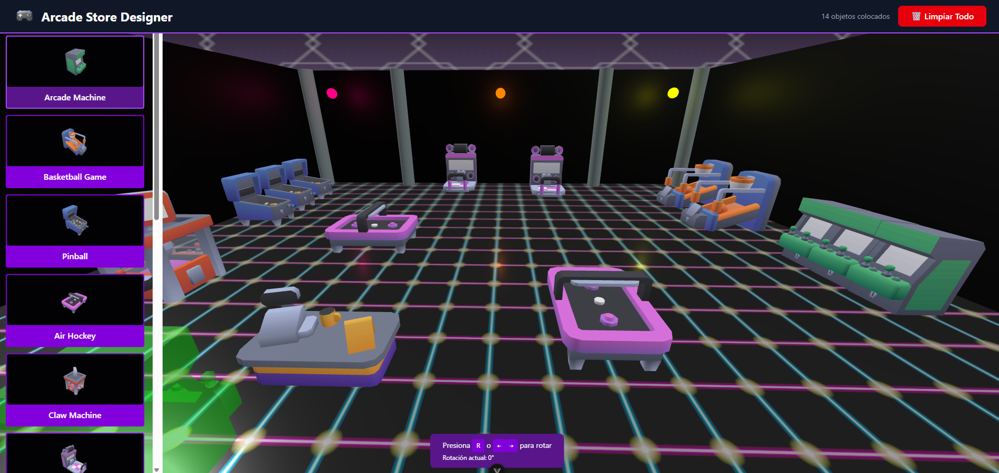

<p align="center">
  
</p>

<h1 align="center">Ruth Daniela Aguirre</h1>

<p align="center">
  Fullstack Developer 
  <br />
  Designing and building digital experiences with clarity, depth, and visual character.
</p>

<p align="center">
  
  
  
  
  
</p>

## Portfolio

This portfolio showcases selected work by Ruth Daniela Aguirre across frontend, backend, interactive media, and product storytelling. It is designed to reflect both technical range and creative direction through a curated, bilingual, editorial-style experience.


## Preview

<p align="center">
  
  
  
</p>

## Highlights

- Bilingual portfolio experience in Spanish and English.
- Built with React, TypeScript, and a reusable component-driven architecture.
- Dedicated project detail pages to present work with stronger narrative context.
- Distinct editorial visual system with a premium dark aesthetic.
- Production-ready deployment on Vercel with SPA route handling.

## What This Portfolio Communicates

- Strong visual judgment alongside solid implementation.
- Comfort working across product, interface, and interactive experience design.
- Ability to translate ideas into polished, deployable digital work.
- A portfolio presentation designed for recruiters, collaborators, and creative tech teams.

## Stack

- React
- TypeScript
- Vite
- React Router
- i18next
- Motion
- Tailwind CSS v4
- Radix UI

## Selected Projects

### MonGame

An immersive educational platform built around real-time 3D experiences, combining engagement, spatial interaction, and product thinking.

- GitHub: https://github.com/RuthDanielaAguirre/MonGame
- Demo: https://youtube.com/shorts/30x-3nQtL3k?feature=share

### The LightHunt

An augmented reality web game that blends spatial audio, exploration, and playful interaction into a compact digital experience.

- GitHub: https://github.com/RuthDanielaAguirre/GameJam
- Demo: https://game-h2kw0jtjv-ruthdanielaaguirres-projects.vercel.app/

### Tudu

A voice-first productivity concept with AI-assisted transcription, focused on speed, clarity, and practical day-to-day usability.

- GitHub: https://github.com/RuthDanielaAguirre/TUDU
- Demo: https://vimeo.com/1089235255/f7c9b7c996?share=copy&fl=sv&fe=ci

### Femcoders Club

A community platform created to connect, support, and increase visibility for women in technology.

- GitHub: https://github.com/RuthDanielaAguirre/femCodersClub_Project
- Demo: https://www.femcodersclub.com/

### Arcade 3D

A browser-based collection of interactive 3D experiments that highlights technical curiosity and immersive interface work.

- GitHub: https://github.com/RuthDanielaAguirre/arcade-store-3d
- Demo: https://arcade-store-3d-ddxt6a227-ruthdanielaaguirres-projects.vercel.app/#/


## Structure

```text
src/
  app/
  components/
  data/
  hooks/
  i18n/
  lib/
  styles/
  types/
public/
  images/
```

## Deploy

This portfolio is ready to deploy on Vercel.

1. Import the repository into Vercel.
2. Keep `pnpm` as the package manager.
3. Set `VITE_SITE_URL` to your production domain, for example `https://your-domain.com`.
4. Deploy with the existing defaults from `vercel.json`.

Useful commands:

- `pnpm dev` for local development.
- `pnpm deploy:check` to run typecheck and production build before pushing.
- `pnpm preview` to inspect the built app locally.

During the build, the project generates `robots.txt` and `sitemap.xml` automatically using `VITE_SITE_URL` or Vercel system URLs.
  